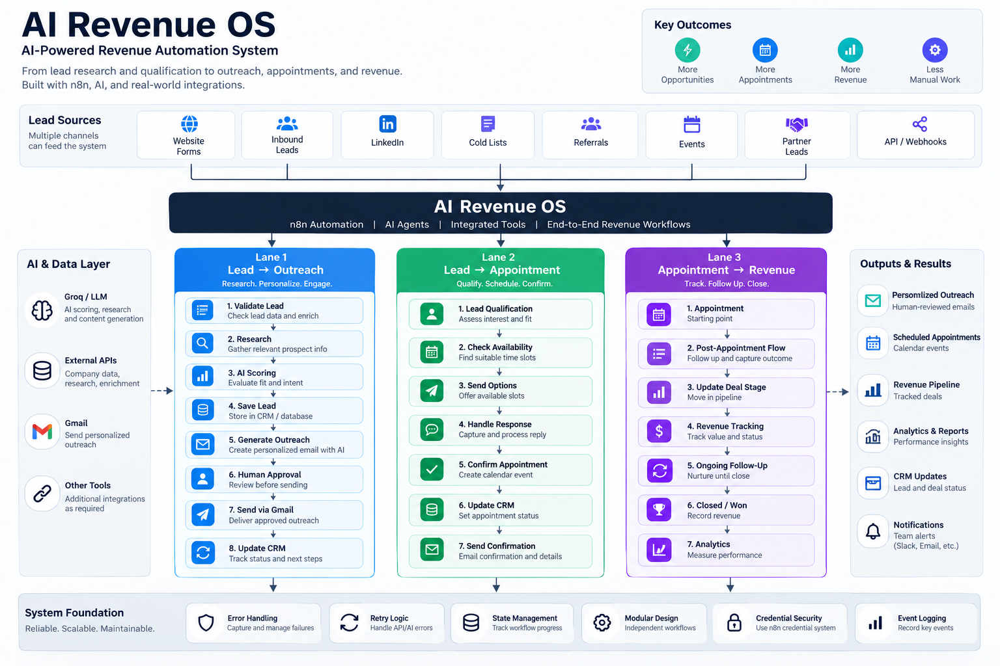

# AI Revenue OS

### AI-Powered Lead-to-Revenue Automation System

**Built with n8n · AI/LLMs · APIs · Webhooks · Gmail · CRM/Data Systems**

AI Revenue OS is an end-to-end automation system designed to automate key stages of the revenue lifecycle — from lead intake and personalized outreach to appointment handling and revenue conversion.

The system combines AI-powered decision making with deterministic business logic and human approval checkpoints to create practical, controllable automation rather than fully autonomous black-box workflows.

---

## Architecture



The system is organized into three independent automation lanes:

**Lane 1 — Lead → Outreach**

Research prospects, score leads, generate personalized outreach, obtain human approval, send the email, and update the CRM.

**Lane 2 — Lead → Appointment**

Process inbound leads, qualify conversations, handle appointment requests, book appointments, and update lead status.

**Lane 3 — Appointment → Revenue**

Generate proposals, apply controlled pricing logic, obtain approval, send proposals, handle customer decisions, and update revenue outcomes.

> The three lanes are packaged in one n8n workflow file but are independently triggered by their own webhooks.

---

# What Problem It Solves

Revenue teams often lose time between lead generation, qualification, outreach, scheduling, and follow-up.

Common problems include:

- Manual prospect research
- Generic outreach
- Slow lead qualification
- Repetitive CRM updates
- Manual appointment handling
- Delayed proposal generation
- Inconsistent follow-up
- Lack of human control over AI-generated actions

AI Revenue OS connects these stages into structured automation workflows.

---

# System Overview

```text
                    AI REVENUE OS
                         │
          ┌──────────────┼──────────────┐
          │              │              │
          ▼              ▼              ▼

     LEAD → OUTREACH  LEAD → APPOINTMENT  APPOINTMENT → REVENUE

     Research         Qualification       Proposal
        ↓                  ↓                  ↓
     AI Scoring       AI / Rules          Human Approval
        ↓                  ↓                  ↓
     Personalize       Appointment        Customer Decision
        ↓                Handling              ↓
     Human Approval       ↓               Won / Lost
        ↓              CRM Update             ↓


Lane 1 — Lead → Outreach
Research · Score · Personalize · Approve · Send

Workflow:

Webhook
   ↓
Validate + Sanitize
   ↓
Research Prospect
   ↓
AI Lead Scoring
   ↓
Save Lead
   ↓
AI Personalized Outreach
   ↓
Human Approval
   ↓
Gmail
   ↓
Update CRM
Key capabilities
Lead input through webhook
Input validation and sanitization
Prospect research through external APIs
AI-based lead scoring
Personalized outreach generation
Human approval before sending
Gmail delivery
CRM/activity update
Reliability

The workflow includes retry handling for external HTTP requests and a fallback for malformed AI scoring responses.

Lane 2 — Lead → Appointment
Qualify · Respond · Book · Update

This lane processes inbound lead conversations and determines the appropriate next action.

Workflow:

Inbound Message
      ↓
Validate Input
      ↓
Find / Create Lead
      ↓
AI Qualification + Decision
      ↓
Parse + Validate
      ↓
 ┌───────────────┐
 │               │
 ▼               ▼
Update CRM    AI Reply
 │
 ▼
Interested?
 │
 ├── Yes → Book Appointment
 │             ↓
 │        Update Appointment
 │
 └── No → Schedule Follow-up
Key capabilities
Inbound webhook processing
Lead lookup / creation
AI qualification
Structured AI decision output
Automated response generation
Interested-lead routing
Appointment booking
CRM updates
Follow-up scheduling
Lane 3 — Appointment → Revenue
Proposal · Approval · Decision · Revenue

Workflow:

Proposal Webhook
      ↓
Get Lead + Requirements
      ↓
AI Proposal Generation
      ↓
Parse Proposal
      ↓
Save Proposal
      ↓
Human Approval
      ↓
Approved?
      │
      ├── No → Stop / Review
      │
      └── Yes
            ↓
        Send Proposal
            ↓
      Customer Decision
            ↓
       ┌────┴────┐
       ▼         ▼
    Accepted   Rejected
       ↓         ↓
    WON       LOST /
    Revenue   Follow-up
Important engineering decision

AI does not control proposal pricing.

The proposal content can be generated by AI, but pricing is controlled through deterministic business logic rather than blindly trusting an LLM-generated price.

This reduces the risk of unintended pricing changes caused by AI output.

AI Architecture

AI is used where probabilistic reasoning provides value.

AI responsibilities
Prospect analysis
Lead scoring
Qualification
Research interpretation
Personalized outreach generation
Conversational response generation
Proposal content generation
Deterministic responsibilities

Business-critical logic remains controlled by workflow logic:

Input validation
Data sanitization
Branching
Approval gates
CRM state changes
Appointment state
Pricing control
Revenue status
Error handling

This creates a hybrid architecture:

              AI
       Reasoning / Generation
                │
                ▼
        Deterministic Logic
       Validation / Decisions
                │
                ▼
         Human Approval
                │
                ▼
          External Action
Human-in-the-Loop

The system intentionally avoids giving AI unrestricted control over business-critical actions.

Human approval is used before important outbound actions such as:

Sending personalized outreach
Sending proposals
Other revenue-impacting actions

This allows AI to handle the repetitive reasoning while keeping final control with the operator.

Reliability & Error Handling

The workflows are designed with practical reliability mechanisms including:

Input validation
Data sanitization
Structured AI outputs
AI response parsing
Fallback handling
HTTP retry behavior
Human approval checkpoints
Controlled state updates
CRM logging

The goal is not simply to connect nodes together, but to make automation behavior predictable when external services or AI responses fail.

Technology Stack
Technology	Purpose
n8n	Workflow orchestration
Groq / LLMs	AI reasoning and generation
Webhooks	Workflow triggers and integrations
HTTP APIs	Research and external services
Gmail	Email delivery
CRM / Data Store	Lead and revenue state
JavaScript	Validation, transformation and business logic
Repository Structure
ai-revenue-os/
│
├── README.md
│
├── architecture/
│   └── overview.png
│
├── workflows/
│   └── ai-revenue-os-sanitized.json
│
└── examples/
    ├── sample-input.json
    └── sample-output.json
Workflow File

The repository includes the sanitized n8n workflow:

workflows/ai-revenue-os-sanitized.json

The workflow contains the three AI Revenue OS lanes in a single n8n file.

Credentials and runtime state are intentionally excluded from the public workflow file.

Before deploying the workflow, users should configure their own credentials and environment-specific integrations.

Example Input / Output

Example webhook inputs and representative outputs are available in:

examples/sample-input.json
examples/sample-output.json

These examples demonstrate the type of structured data processed by the system without exposing real customer information or credentials.

Security

No production credentials should be committed to this repository.

The public workflow has been sanitized to remove credential bindings and runtime/test state.

When deploying the workflow:

Use environment-specific credentials
Never hard-code API keys
Never commit passwords or access tokens
Use n8n credential management
Replace example data with production data
Review webhook authentication before deployment
Project Status

Status: Portfolio / Independent Project

This project was designed and built as an independent AI automation system to demonstrate practical capabilities in:

n8n workflow development
AI automation
LLM integration
API integration
Webhook architecture
Business process automation
CRM workflows
Human-in-the-loop systems
Reliability engineering
Revenue workflow automation
What This Project Demonstrates

This project demonstrates the ability to design automation beyond simple AI prompts.

It combines:

AI + APIs + business logic + workflow orchestration + human approval + external actions + state management

into a single revenue-oriented automation system.
     Gmail                                     
        ↓                                   Revenue
     CRM Update                              Tracking
